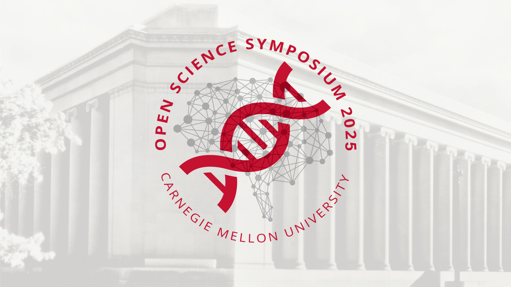

## Open Science Symposium 2025

### November 13, 2025

Join us for our signature open science event, a full day of virtual talks and panels from researchers and thought leaders in academia, industry, and publishing. The conference will explore how open science is transforming the ways in which we do research and share it in a variety of science and non-science disciplines

The conference will explore how open science is transforming the ways in which 
we do research and share it in a variety of science and non-science disciplines.

We will also have the following satellite events this fall:

- *The Open Science Primer, a train-the-trainer style program for academic library professionals, will be held at Carnegie Mellon University on October 14-15, 2025. Other training locations and online training are also available. Register <a href="https://guides.library.cmu.edu/openscienceprimer/register" target="_blank">here</a>*
- The Open Unconference, a full day of participant-driven discussions about all things open for academic library professionals, will be held at Carnegie Mellon University on October 16, 2025.
